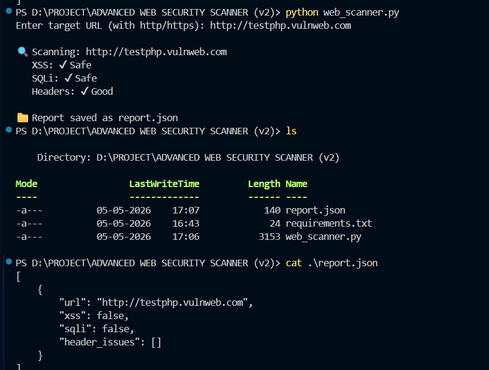

# 🔍 Advanced Web Security Scanner

## 📌 Overview

This project is a Python-based web security scanner designed to identify basic security issues in web applications.

It performs automated checks for common vulnerabilities and analyzes security headers while crawling limited pages.

---

## 🚀 Features

* Detects possible XSS (Cross-Site Scripting)
* Detects possible SQL Injection patterns
* Analyzes important security headers
* Crawls internal links (limited depth)
* Generates a JSON report
* Displays live scan results in terminal

---

## 🛠️ Technologies Used

* Python
* requests
* BeautifulSoup

---

## ▶️ How to Run

1. Install dependencies:
   pip install -r requirements.txt

2. Run the scanner:
   python web_scanner.py

3. Enter target URL (example):
   http://example.com

---

## 📸 Example Output

---

## 📁 Report Output

The scan results are saved in:
report.json

---

## ⚠️ Disclaimer

This tool is for educational purposes only.
Only test on websites you own or have permission to scan.

---

## 🎯 Future Improvements

* Form-based vulnerability scanning
* Multi-threading for faster scanning
* Advanced payload testing
* HTML report generation

---

## 👨‍💻 About Me

I am a cybersecurity enthusiast and a diploma student, focused on building practical security tools and improving my real-world understanding of cybersecurity concepts.
